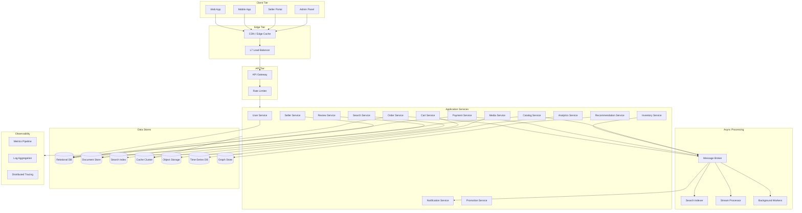

# Highload Marketplace -- System Overview

## 1. Domain Actors

| Actor | Description |
|-------|-------------|
| **Buyer** | Browses catalog, searches products, places orders, tracks deliveries, leaves reviews |
| **Seller** | Manages storefronts, lists products, fulfills orders, handles returns |
| **Operator** | Monitors platform health, resolves disputes, manages categories, configures promotions |
| **System** | Background jobs, event processors, indexers, analytics pipelines |

## 2. High-Level Component Diagram

## 3. Subsystem Responsibilities

### Client Tier
- **Web App / Mobile App** -- buyer-facing storefronts; server-side rendered pages with client hydration for high SEO and fast first paint.
- **Seller Portal** -- product management, order fulfillment, analytics dashboards.
- **Admin Panel** -- operator tooling for dispute resolution, category management, platform configuration.

### Edge Tier
- **CDN / Edge Cache** -- serves static assets (images, JS bundles, CSS) and caches frequently requested catalog pages. Deployed across multiple PoPs for geographic distribution.
- **L7 Load Balancer** -- terminates TLS, routes requests to API gateway instances, performs health checks.

### API Tier
- **API Gateway** -- single entry point for all client requests. Handles request routing, protocol translation (REST/gRPC), request/response transformation, and aggregation of multiple downstream calls.
- **Rate Limiter** -- token-bucket or sliding-window limiter protecting backend services from traffic spikes. Backed by distributed cache for shared state.

### Application Services
Each service owns its data and exposes a well-defined API (synchronous gRPC/REST for queries, asynchronous events for state changes).

| Service | Owns | Key Operations |
|---------|------|----------------|
| User Service | User profiles, addresses | Registration, profile CRUD, address management |
| Catalog Service | Product documents, variants | Product CRUD, variant management, category assignment |
| Search Service | Search query execution | Full-text search, faceted filtering, autocomplete |
| Cart Service | Shopping carts | Add/remove items, apply coupons, cart expiry |
| Order Service | Orders, order state machine | Order placement, status transitions, cancellation |
| Payment Service | Transactions, refunds | Payment initiation, callback handling, refund processing |
| Inventory Service | Stock levels | Reserve/release stock, low-stock alerts |
| Notification Service | Notification templates, delivery log | Email, SMS, push dispatch |
| Review Service | Reviews, ratings | Submit/moderate reviews, aggregate ratings |
| Seller Service | Seller accounts, payouts | Onboarding, payout scheduling, performance metrics |
| Promotion Service | Coupons, discounts, campaigns | Create/validate promotions, apply discount rules |
| Analytics Service | Aggregated metrics | Real-time dashboards, report generation |
| Media Service | Image/video metadata | Upload, resize, CDN URL generation |
| Recommendation Service | User-product graph | Personalized recommendations, "frequently bought together" |

### Async Processing
- **Message Broker** -- durable, partitioned event log. Central nervous system for inter-service communication.
- **Search Indexer** -- consumes catalog change events, maintains search index in near-real-time.
- **Stream Processor** -- consumes analytics and business event streams, produces aggregations for dashboards and data warehouse.
- **Background Workers** -- scheduled and triggered jobs: cart expiry cleanup, payout batch processing, report generation.

## 4. Non-Functional Requirements (Target)

| Metric | Target |
|--------|--------|
| Peak requests/sec (read) | 50,000 - 100,000 |
| Peak orders/sec (write) | 1,000 - 5,000 |
| Catalog search p99 latency | < 200 ms |
| Product page p99 latency | < 150 ms (cache hit), < 500 ms (cache miss) |
| Order placement p99 latency | < 1,000 ms |
| Availability | 99.95% (platform), 99.99% (payment path) |
| Data durability | No data loss for financial records (sync replication) |
| Catalog size | 10M - 100M SKUs |
| Concurrent users | 500K - 1M |

## 5. Technology Stack Summary

| Layer | Pattern / Category | Purpose |
|-------|--------------------|---------|
| Container Runtime | OCI-compatible (Docker-pattern) | Application packaging |
| Orchestration | Kubernetes-pattern | Service deployment, scaling, self-healing |
| Service Communication | gRPC (internal), REST (external) | Synchronous RPC |
| Event Streaming | Kafka-pattern | Asynchronous event-driven communication |
| Relational DB | PostgreSQL-pattern | Transactional data (users, orders, payments) |
| Document Store | MongoDB-pattern | Flexible-schema data (catalog, reviews) |
| Search Engine | Elasticsearch-pattern | Full-text search, faceted navigation |
| Cache | Redis-pattern | Session, cart, hot data caching |
| Object Storage | MinIO-pattern | Images, documents, exports |
| Time-Series DB | VictoriaMetrics-pattern | Metrics storage |
| Graph DB | Neo4j-pattern | Recommendations, relationship queries |
| Stream Processing | Flink-pattern | Real-time aggregation, analytics |
| Metrics | Prometheus-pattern | Metric collection and alerting |
| Logging | ELK-pattern | Centralized log aggregation |
| Tracing | Jaeger/Zipkin-pattern | Distributed request tracing |
| CI/CD | GitOps-pattern | Automated build, test, deploy pipelines |

## 6. Cross-Cutting Concerns

- **Idempotency** -- all write operations expose idempotency keys to safely handle retries.
- **Circuit Breaking** -- services implement circuit breakers to prevent cascade failures.
- **Graceful Degradation** -- if a non-critical service (recommendations, reviews) is down, the core purchase flow continues with reduced functionality.
- **Feature Flags** -- runtime toggles for gradual rollouts and instant rollbacks.
- **Configuration Management** -- centralized config store with hot-reload support, environment-specific overrides.
