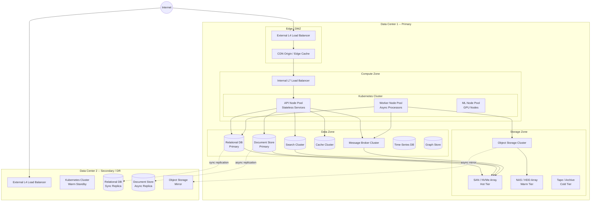
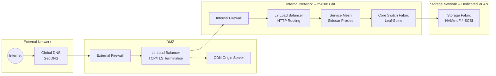
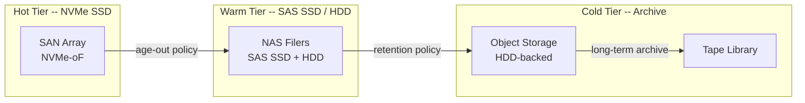
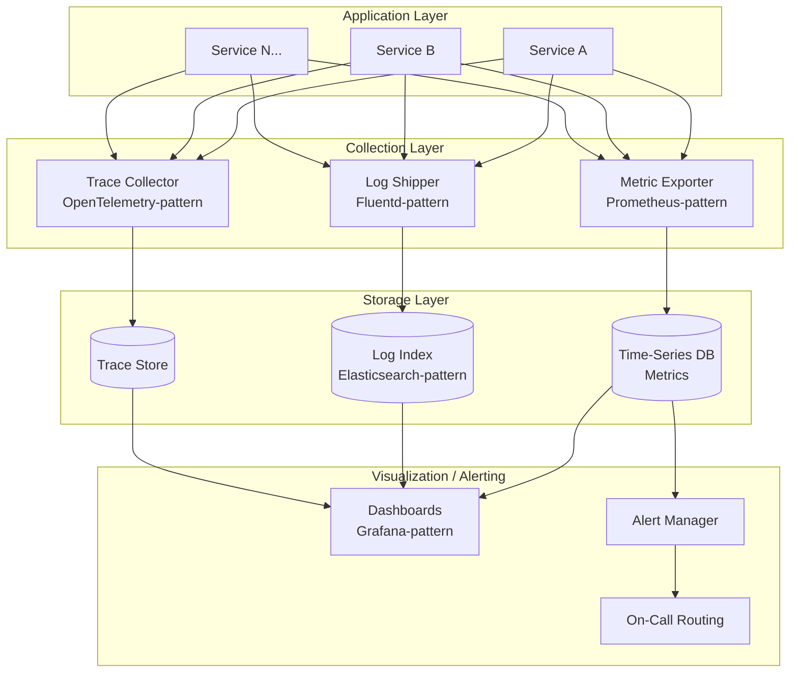

# On-Premises Infrastructure

## 1. Physical / Logical Topology

## 2. Compute Layer

### 2.1 Container Orchestration (Kubernetes-pattern)

All application workloads run in containers managed by a Kubernetes-compatible orchestrator. The cluster is divided into node pools by workload profile:

| Node Pool | Hardware Profile | Workloads | Scaling Strategy |
|-----------|-----------------|-----------|-----------------|
| **API Pool** | 32-64 vCPU, 64-128 GB RAM, NVMe local disk | API Gateway, all stateless microservices | Horizontal Pod Autoscaler on CPU/RPS |
| **Worker Pool** | 16-32 vCPU, 64-128 GB RAM, large local disk | Event consumers, search indexers, batch jobs | HPA on queue depth / consumer lag |
| **ML Pool** | 16 vCPU, 64 GB RAM, 1-2 GPU (inference-grade) | Recommendation engine, image classification, fraud scoring | Fixed pool + burst on demand |
| **System Pool** | 8-16 vCPU, 32 GB RAM | Monitoring agents, log collectors, DNS, ingress controllers | Fixed size |

### 2.2 Bare Metal vs Virtualization

| Component | Deployment Model | Rationale |
|-----------|-----------------|-----------|
| Kubernetes worker nodes | VMs on hypervisor | Flexible resizing, live migration during maintenance |
| Relational DB primary | Bare metal | Maximum I/O performance, no hypervisor overhead |
| Message broker | Bare metal | Predictable latency, direct NVMe access |
| Search cluster | Bare metal or VM | Depends on index size; bare metal for clusters > 10 nodes |
| Object storage | Bare metal | Direct disk access for erasure coding efficiency |

### 2.3 Capacity Planning

- **Baseline capacity**: provision for 2x average load to absorb daily peaks.
- **Burst headroom**: keep 30% cluster capacity free for traffic spikes (flash sales, seasonal events).
- **Growth runway**: plan hardware procurement 6 months ahead based on trailing growth rate.
- **Load testing**: quarterly full-system load tests at 3x peak to validate headroom.

## 3. Network Layer

### 3.1 Network Topology

### 3.2 Load Balancing

| Layer | Type | Function |
|-------|------|----------|
| **L4 (Transport)** | Hardware or high-performance software LB | TLS termination, TCP connection distribution, health checks |
| **L7 (Application)** | Software LB (HAProxy/Envoy-pattern) | Path-based routing, header inspection, request rate limiting |
| **Service Mesh** | Sidecar proxy (Envoy-pattern) | Service-to-service load balancing, retries, circuit breaking, mTLS |

### 3.3 DNS Strategy

- **External DNS**: GeoDNS directs users to the nearest data center. TTL 60s for fast failover.
- **Internal DNS**: Kubernetes-native service discovery (CoreDNS-pattern). Services resolve by name within the cluster.
- **Split-horizon**: internal services are not resolvable from outside the cluster.

### 3.4 CDN / Edge Caching

- CDN is deployed as a reverse proxy layer in front of the origin.
- **Cached content**: product images, static assets (JS/CSS), rendered catalog pages (short TTL: 30-60s), search result pages (very short TTL: 5-10s).
- **Cache invalidation**: event-driven purge via API when catalog data changes; stale-while-revalidate for non-critical content.
- **Multiple PoPs**: on-prem CDN nodes can be placed in regional offices or colocation facilities to reduce latency for geographically distributed users.

### 3.5 Inter-DC Connectivity

- Dedicated dark fiber or leased line between primary and DR data centers.
- Minimum bandwidth: 10 Gbps dedicated for replication traffic.
- Latency budget: < 5 ms round-trip for synchronous DB replication.
- VPN fallback over public internet if dedicated link fails.

## 4. Storage Hardware

### 4.1 Storage Tiers

| Tier | Media | Latency | Use Cases | Retention |
|------|-------|---------|-----------|-----------|
| **Hot** | NVMe SSD (SAN) | < 0.5 ms | Relational DB, message broker, search indices, cache persistence | Active data (< 30 days) |
| **Warm** | SAS SSD + HDD (NAS) | 1-5 ms | Object storage (recent images), document store secondary, logs | 30-180 days |
| **Cold** | HDD (object store) | 10-50 ms | Old order archives, historical analytics, compliance exports | 180 days - 3 years |
| **Archive** | Tape / deep archive | seconds-minutes | Legal holds, regulatory retention, full backups | 3-10 years |

### 4.2 Storage Allocation by Service

| Data Store | Storage Tier | Estimated Size (at scale) | IOPS Requirement |
|------------|-------------|--------------------------|-----------------|
| Relational DB (primary) | Hot (NVMe) | 2-10 TB | 50K-200K |
| Relational DB (replicas) | Hot (NVMe) | 2-10 TB per replica | 30K-100K (read) |
| Document Store | Hot (NVMe) + Warm | 5-50 TB | 20K-100K |
| Search Index | Hot (NVMe) | 2-20 TB | 30K-80K |
| Cache (persistence) | Hot (NVMe) | 0.5-2 TB | 100K+ |
| Message Broker | Hot (NVMe) | 5-20 TB (retention window) | 50K-150K |
| Object Storage | Warm + Cold | 50-500 TB | Low (throughput-oriented) |
| Time-Series DB | Warm | 1-10 TB | 10K-30K |

## 5. Observability Stack

### 5.1 Three Pillars

### 5.2 Metrics Pipeline (Prometheus-pattern)

- **Collection**: each service exposes a `/metrics` endpoint. A scraper collects metrics every 15s.
- **Storage**: time-series database with 15-day high-resolution retention, 1-year downsampled retention.
- **Key metrics**:
  - RED (Rate, Errors, Duration) per service
  - USE (Utilization, Saturation, Errors) per infrastructure component
  - Business metrics: orders/min, GMV, cart conversion rate
- **Alerting**: multi-tier alert rules (critical: pages on-call, warning: Slack channel, info: dashboard annotation).

### 5.3 Log Aggregation (ELK-pattern)

- **Shipping**: sidecar or DaemonSet log agent forwards structured JSON logs.
- **Processing**: log pipeline normalizes fields, redacts sensitive data, enriches with trace IDs.
- **Storage**: search-optimized index with 30-day hot retention, 90-day warm, 1-year cold archive.
- **Structured logging standard**: all services emit logs with `trace_id`, `service`, `level`, `timestamp`, `message`, and domain-specific fields.

### 5.4 Distributed Tracing (OpenTelemetry-pattern)

- **Instrumentation**: OpenTelemetry SDK in every service. Auto-instrumentation for HTTP/gRPC frameworks.
- **Sampling**: head-based sampling at 10% for normal traffic, 100% for errors and slow requests (tail-based sampling).
- **Trace propagation**: W3C TraceContext headers across all service boundaries.
- **Visualization**: trace waterfall view correlating spans across services, linked to logs and metrics.

## 6. Scaling Strategy

### 6.1 Horizontal Scaling

| Component | Scaling Trigger | Scale Unit | Min / Max |
|-----------|----------------|------------|-----------|
| API Services | CPU > 60% or RPS per pod > threshold | +1 pod | 3 / 50 per service |
| Event Consumers | Consumer lag > threshold | +1 pod per partition | 1 / partition count |
| Search Cluster | Query latency p99 > 200ms | +1 data node | 3 / 30 |
| Cache Cluster | Memory utilization > 75% | +1 shard | 6 / 60 |
| Kubernetes Nodes | Pending pods > 0 for > 2 min | +1 VM (cluster autoscaler) | Pool-specific |

### 6.2 Vertical Scaling (when horizontal is impractical)

- Relational DB primary: scale up CPU/RAM before adding shards (sharding has high operational cost).
- Message broker: increase per-broker disk and memory before adding brokers.

### 6.3 Pre-Scaling for Planned Events

- Flash sales, holiday peaks: pre-scale API pool and cache cluster 2 hours before event.
- Automated runbooks triggered by calendar events or manual operator action.
- Warm-up procedures: pre-populate cache, pre-scale search replicas, increase rate limits.
