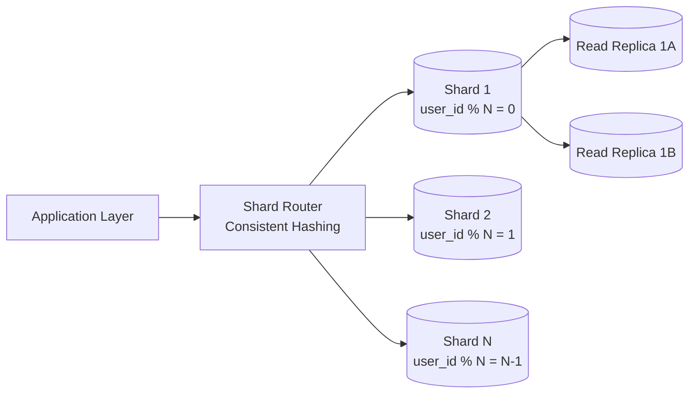
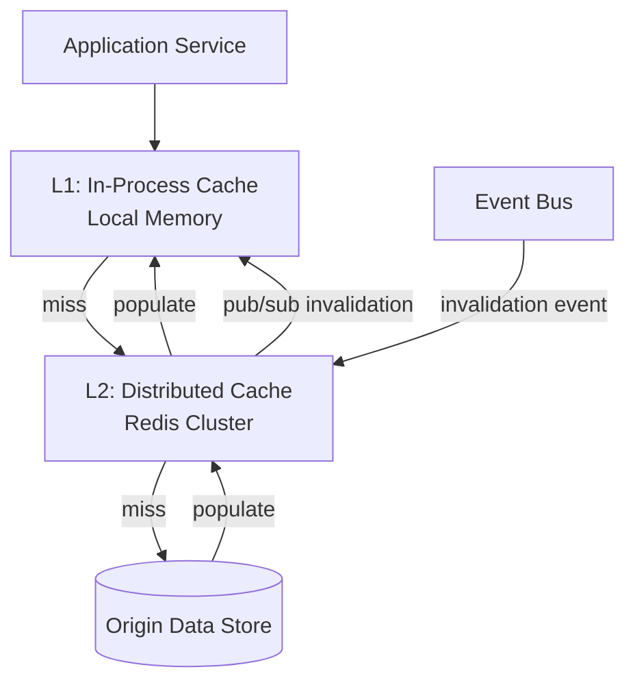
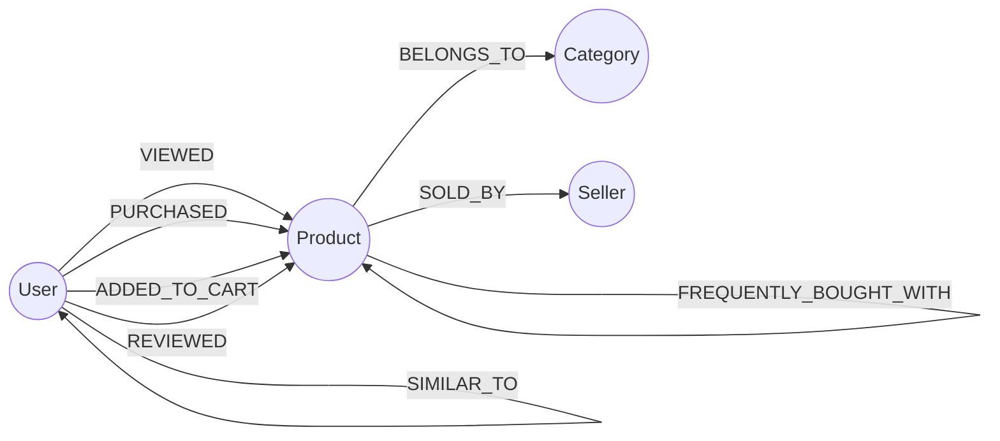

# Data Stores

## 1. Data Store Ownership Map

```mermaid
graph TB
    subgraph services [Application Services]
        UserSvc[User Service]
        OrderSvc[Order Service]
        PaymentSvc[Payment Service]
        SellerSvc[Seller Service]
        CatalogSvc[Catalog Service]
        ReviewSvc[Review Service]
        SearchSvc[Search Service]
        CartSvc[Cart Service]
        InventorySvc[Inventory Service]
        NotificationSvc[Notification Service]
        AnalyticsSvc[Analytics Service]
        MediaSvc[Media Service]
        RecommendationSvc[Recommendation Service]
        PromotionSvc[Promotion Service]
    end

    subgraph relational [Relational DB Cluster]
        UsersDB[(users schema)]
        OrdersDB[(orders schema)]
        PaymentsDB[(payments schema)]
        SellersDB[(sellers schema)]
        InventoryDB[(inventory schema)]
        PromotionsDB[(promotions schema)]
    end

    subgraph document [Document Store Cluster]
        ProductsColl[(products collection)]
        VariantsColl[(variants collection)]
        ReviewsColl[(reviews collection)]
        StorefrontsColl[(storefronts collection)]
        NotificationsColl[(notification_log collection)]
    end

    subgraph search [Search Index Cluster]
        ProductIdx[products index]
        SellerIdx[sellers index]
        OrderIdx[orders index -- ops]
    end

    subgraph cache [Cache Cluster]
        SessionCache[sessions]
        CartCache[carts]
        CatalogCache[catalog pages]
        InventoryCache[stock levels]
        ConfigCache[feature flags / config]
    end

    subgraph blob [Object Storage]
        ProductImages[product-images bucket]
        SellerDocs[seller-documents bucket]
        Invoices[invoices bucket]
        Exports[exports bucket]
    end

    subgraph tsdb [Time-Series DB]
        BizMetrics[business KPIs]
        InfraMetrics[infrastructure metrics]
    end

    subgraph graph [Graph Store]
        UserProductGraph[user-product edges]
        FraudGraph[transaction graph]
    end

    subgraph broker [Message Broker]
        OrderEvents[order-events topic]
        PaymentEvents[payment-events topic]
        InventoryEvents[inventory-updates topic]
        CatalogEvents[catalog-changes topic]
        NotifTriggers[notification-triggers topic]
        AnalyticsStream[analytics-stream topic]
        SearchReindex[search-reindex topic]
    end

    UserSvc -->|owns R/W| UsersDB
    OrderSvc -->|owns R/W| OrdersDB
    PaymentSvc -->|owns R/W| PaymentsDB
    SellerSvc -->|owns R/W| SellersDB
    InventorySvc -->|owns R/W| InventoryDB
    PromotionSvc -->|owns R/W| PromotionsDB

    CatalogSvc -->|owns R/W| ProductsColl
    CatalogSvc -->|owns R/W| VariantsColl
    ReviewSvc -->|owns R/W| ReviewsColl
    SellerSvc -->|owns R/W| StorefrontsColl
    NotificationSvc -->|owns R/W| NotificationsColl

    SearchSvc -->|owns R/W| ProductIdx
    SearchSvc -->|owns R/W| SellerIdx
    SearchSvc -->|owns R/W| OrderIdx

    CartSvc -->|owns R/W| CartCache
    UserSvc -->|R/W| SessionCache
    CatalogSvc -->|writes| CatalogCache
    InventorySvc -->|writes| InventoryCache

    MediaSvc -->|owns R/W| ProductImages
    SellerSvc -->|writes| SellerDocs
    OrderSvc -->|writes| Invoices
    AnalyticsSvc -->|writes| Exports

    AnalyticsSvc -->|owns R/W| BizMetrics
    RecommendationSvc -->|owns R/W| UserProductGraph

    OrderSvc -->|publishes| OrderEvents
    PaymentSvc -->|publishes| PaymentEvents
    InventorySvc -->|publishes| InventoryEvents
    CatalogSvc -->|publishes| CatalogEvents
```



## 2. Relational Database (PostgreSQL-pattern)

### 2.1 Purpose

Stores all transactional, strongly-consistent data where ACID guarantees are required: users, orders, payments, seller accounts, inventory, promotions.

### 2.2 Schema Overview

#### `users` Schema

| Table | Key Columns | Notes |
|-------|-------------|-------|
| `users` | `user_id (PK)`, `email`, `phone`, `display_name`, `created_at`, `status` | Partitioned by `user_id` hash |
| `user_addresses` | `address_id (PK)`, `user_id (FK)`, `type`, `line1`, `city`, `postal_code`, `country` | Max 10 per user |
| `user_preferences` | `user_id (PK)`, `locale`, `currency`, `notification_settings (JSONB)` | 1:1 with users |

#### `orders` Schema

| Table | Key Columns | Notes |
|-------|-------------|-------|
| `orders` | `order_id (PK)`, `buyer_id`, `seller_id`, `status`, `total_amount`, `currency`, `created_at` | Sharded by `buyer_id`; status enum: `pending`, `confirmed`, `paid`, `shipped`, `delivered`, `cancelled`, `refunded` |
| `order_items` | `item_id (PK)`, `order_id (FK)`, `product_id`, `variant_id`, `quantity`, `unit_price`, `subtotal` | Co-located with parent order |
| `order_status_log` | `log_id (PK)`, `order_id (FK)`, `from_status`, `to_status`, `changed_at`, `changed_by` | Append-only audit trail |

#### `payments` Schema

| Table | Key Columns | Notes |
|-------|-------------|-------|
| `transactions` | `tx_id (PK)`, `order_id`, `amount`, `currency`, `method`, `status`, `gateway_ref`, `idempotency_key (UNIQUE)`, `created_at` | Sharded by `order_id`; idempotency key prevents duplicate charges |
| `refunds` | `refund_id (PK)`, `tx_id (FK)`, `amount`, `reason`, `status`, `created_at` | Links back to original transaction |
| `seller_balances` | `seller_id (PK)`, `available_balance`, `pending_balance`, `currency`, `updated_at` | Updated via serializable transaction |
| `payout_ledger` | `entry_id (PK)`, `seller_id`, `amount`, `type (credit/debit)`, `reference`, `created_at` | Immutable double-entry ledger |

#### `sellers` Schema

| Table | Key Columns | Notes |
|-------|-------------|-------|
| `seller_accounts` | `seller_id (PK)`, `business_name`, `status`, `tier`, `commission_rate`, `created_at` | Status: `pending_review`, `active`, `suspended` |
| `seller_bank_info` | `seller_id (PK)`, `bank_name`, `account_number_enc`, `routing_number` | Encrypted at application layer |
| `disputes` | `dispute_id (PK)`, `order_id`, `buyer_id`, `seller_id`, `type`, `status`, `resolution`, `created_at` | Status: `open`, `under_review`, `resolved_buyer`, `resolved_seller` |

#### `inventory` Schema

| Table | Key Columns | Notes |
|-------|-------------|-------|
| `stock_levels` | `product_id (PK)`, `variant_id (PK)`, `warehouse_id`, `available`, `reserved`, `updated_at` | Composite PK; `reserved` tracks in-flight orders |
| `stock_movements` | `movement_id (PK)`, `product_id`, `variant_id`, `delta`, `reason`, `order_id`, `created_at` | Append-only log of every stock change |

#### `promotions` Schema

| Table | Key Columns | Notes |
|-------|-------------|-------|
| `coupons` | `coupon_id (PK)`, `code (UNIQUE)`, `discount_type`, `discount_value`, `min_order_amount`, `max_uses`, `current_uses`, `valid_from`, `valid_until` | Atomically increment `current_uses` |
| `campaigns` | `campaign_id (PK)`, `name`, `type`, `rules (JSONB)`, `start_at`, `end_at`, `status` | JSONB rules engine for flexible discount logic |

### 2.3 Sharding Strategy



- **Shard key**: `user_id` (for users, orders, carts) or `seller_id` (for seller-specific tables).
- **Method**: hash-based consistent hashing at the application routing layer.
- **Cross-shard queries**: avoided by design. Analytical queries go to the read replicas or data warehouse.
- **Rebalancing**: add shards and migrate ranges using logical replication; requires application awareness.

### 2.4 Replication

| Replication Type | Use Case | Lag Target |
|-----------------|----------|------------|
| **Synchronous** (within DC) | Primary -> standby for automatic failover | 0 ms (committed on both) |
| **Asynchronous** (within DC) | Primary -> read replicas for read scaling | < 100 ms |
| **Asynchronous** (cross-DC) | Primary DC -> DR site | < 1 s |

- **Connection pooling**: a pooler (PgBouncer-pattern) in front of each shard, maintaining 200-500 backend connections per shard while supporting 5,000+ client connections.
- **WAL shipping**: continuous WAL archival to object storage for point-in-time recovery (PITR) with 5-minute RPO.

## 3. Document Store (MongoDB-pattern)

### 3.1 Purpose

Stores data with flexible, deeply nested schemas where the relational model would require excessive joins: product catalogs, reviews, seller storefronts.

### 3.2 Collections

#### `products`

```json
{
  "_id": "prod_abc123",
  "seller_id": "seller_xyz",
  "title": "Wireless Headphones Pro",
  "slug": "wireless-headphones-pro",
  "description": "...",
  "category_path": ["electronics", "audio", "headphones"],
  "brand": "AudioTech",
  "attributes": {
    "color": "black",
    "connectivity": "bluetooth-5.3",
    "battery_hours": 40
  },
  "pricing": {
    "base_price": 9999,
    "currency": "USD",
    "sale_price": 7999,
    "sale_ends": "2026-03-01T00:00:00Z"
  },
  "media": [
    { "type": "image", "url": "/product-images/prod_abc123/main.webp", "sort": 0 },
    { "type": "image", "url": "/product-images/prod_abc123/side.webp", "sort": 1 }
  ],
  "rating_summary": {
    "average": 4.3,
    "count": 1247
  },
  "status": "active",
  "created_at": "2026-01-15T10:30:00Z",
  "updated_at": "2026-02-20T14:00:00Z"
}
```

#### `variants`

```json
{
  "_id": "var_def456",
  "product_id": "prod_abc123",
  "sku": "AH-PRO-BLK-L",
  "attributes": { "color": "black", "size": "L" },
  "price_override": null,
  "stock_status": "in_stock",
  "weight_grams": 280,
  "dimensions": { "length_cm": 20, "width_cm": 18, "height_cm": 8 }
}
```

#### `reviews`

```json
{
  "_id": "rev_ghi789",
  "product_id": "prod_abc123",
  "user_id": "user_001",
  "order_id": "ord_999",
  "rating": 5,
  "title": "Great sound quality",
  "body": "...",
  "media": [{ "type": "image", "url": "/review-images/rev_ghi789/photo1.webp" }],
  "verified_purchase": true,
  "helpful_votes": 42,
  "status": "published",
  "created_at": "2026-02-01T08:15:00Z"
}
```

#### `storefronts`

```json
{
  "_id": "sf_seller_xyz",
  "seller_id": "seller_xyz",
  "display_name": "AudioTech Official",
  "logo_url": "/seller-images/seller_xyz/logo.webp",
  "banner_url": "/seller-images/seller_xyz/banner.webp",
  "description": "...",
  "policies": {
    "return_window_days": 30,
    "shipping_info": "..."
  },
  "featured_products": ["prod_abc123", "prod_def456"],
  "stats": {
    "total_products": 156,
    "average_rating": 4.5,
    "response_time_hours": 2
  }
}
```

### 3.3 Sharding and Replication

| Collection | Shard Key | Rationale |
|------------|-----------|-----------|
| `products` | `{ seller_id: "hashed" }` | Co-locates a seller's products; even distribution with hashing |
| `variants` | `{ product_id: "hashed" }` | Co-locates variants with their product |
| `reviews` | `{ product_id: "hashed" }` | Reviews queried by product; high cardinality |
| `storefronts` | `{ seller_id: "hashed" }` | One per seller, evenly distributed |

- **Replica set per shard**: 1 primary + 2 secondaries (one in same rack, one in different rack for fault tolerance).
- **Read preference**: `primaryPreferred` for catalog reads (eventual consistency acceptable), `primary` for writes.
- **Write concern**: `w: majority` for all writes.

## 4. Search Index (Elasticsearch-pattern)

### 4.1 Purpose

Powers full-text search, faceted navigation, autocomplete, and operational search for the admin panel.

### 4.2 Indices

#### `products` Index

```json
{
  "mappings": {
    "properties": {
      "product_id":    { "type": "keyword" },
      "title":         { "type": "text", "analyzer": "standard", "fields": { "keyword": { "type": "keyword" } } },
      "description":   { "type": "text", "analyzer": "standard" },
      "category_path": { "type": "keyword" },
      "brand":         { "type": "keyword" },
      "seller_id":     { "type": "keyword" },
      "price":         { "type": "scaled_float", "scaling_factor": 100 },
      "sale_price":    { "type": "scaled_float", "scaling_factor": 100 },
      "rating_avg":    { "type": "half_float" },
      "rating_count":  { "type": "integer" },
      "in_stock":      { "type": "boolean" },
      "attributes":    { "type": "nested" },
      "suggest":       { "type": "completion" },
      "created_at":    { "type": "date" },
      "updated_at":    { "type": "date" }
    }
  }
}
```

**Facets**: category, brand, price range, rating, availability, seller, dynamic attributes (color, size, etc.).

#### `sellers` Index

- Fields: `seller_id`, `display_name`, `categories`, `rating_avg`, `location`, `status`.
- Used for seller directory and admin search.

#### `orders` Index (Ops)

- Fields: `order_id`, `buyer_email`, `seller_name`, `status`, `total_amount`, `created_at`.
- Used by admin panel for order lookup and dispute investigation. Not exposed to buyers/sellers.

### 4.3 Cluster Topology

| Node Role | Count | Spec | Purpose |
|-----------|-------|------|---------|
| Master-eligible | 3 | 8 vCPU, 16 GB RAM | Cluster state management |
| Data (hot) | 6-20 | 16 vCPU, 64 GB RAM, NVMe | Active indices, recent data |
| Data (warm) | 3-6 | 8 vCPU, 32 GB RAM, SAS SSD | Older indices (orders > 90 days) |
| Coordinating | 3-6 | 16 vCPU, 32 GB RAM | Query routing, scatter-gather, aggregation |
| Ingest | 2-4 | 8 vCPU, 16 GB RAM | Indexing pipeline, field transformation |

- **Shards per index**: `products` = 12 primary shards, 1 replica each (24 total). Sized for ~50 GB per shard.
- **Refresh interval**: 1 second (near-real-time search).
- **Index lifecycle**: hot (0-90 days) -> warm (90-365 days) -> delete (> 365 days for ops indices).

### 4.4 Indexing Pipeline

See [03-data-flows.md](03-data-flows.md) -- Search Indexing Pipeline for the full flow. Summary:

1. Catalog Service writes to Document Store.
2. Change Data Capture (CDC) emits event to `search-reindex` topic on Message Broker.
3. Search Indexer consumer reads events, transforms to index document, upserts into search cluster.
4. Typical indexing lag: 1-3 seconds from write to searchable.

## 5. Cache Layers (Redis-pattern)

### 5.1 Cache Architecture



### 5.2 L1: In-Process Cache

- **Implementation**: LRU cache in application memory (e.g., Caffeine-pattern for JVM, lru-cache for Node.js).
- **TTL**: 30-60 seconds (short to limit staleness).
- **Content**: feature flags, category tree, rate limit config, hot product metadata.
- **Size limit**: 50-200 MB per pod (bounded to avoid OOM).
- **Invalidation**: TTL-based + pub/sub signal from L2 cache.

### 5.3 L2: Distributed Cache (Redis Cluster)

| Namespace | Data Structure | TTL | Eviction | Approx Size |
|-----------|---------------|-----|----------|-------------|
| `session:{user_id}` | Hash | 24h | LRU | 1-5 KB per session |
| `cart:{user_id}` | Hash | 7 days | No eviction (explicit delete) | 2-10 KB per cart |
| `product:{product_id}` | String (JSON) | 5 min | LRU | 2-5 KB per product |
| `catalog:page:{hash}` | String (compressed) | 60s | LRU | 10-50 KB per page |
| `search:result:{hash}` | String (compressed) | 30s | LRU | 5-20 KB per result |
| `stock:{product_id}:{variant_id}` | String (integer) | 60s | LRU | < 100 bytes |
| `rate_limit:{client_id}` | String (counter) | Window-based | TTL | < 100 bytes |
| `config:flags` | Hash | 30s | LRU | 1-10 KB |
| `leaderboard:top_sellers` | Sorted Set | 5 min | LRU | 10-50 KB |

### 5.4 Cluster Sizing

- **Topology**: Redis Cluster mode with 6-30 masters, each with 1 replica (12-60 nodes total).
- **Memory per node**: 32-64 GB, with `maxmemory-policy: allkeys-lru` for cache namespaces.
- **Persistence**: RDB snapshots every 5 minutes + AOF for cart data (carts are the primary data store, not just cache).
- **Total cluster memory**: 200 GB - 1 TB depending on catalog size and traffic.

### 5.5 Cache Invalidation Strategies

| Strategy | When Used | Mechanism |
|----------|-----------|-----------|
| **TTL expiry** | General cache entries | Redis key TTL; simplest, eventual consistency |
| **Event-driven purge** | Product update, price change, stock change | Service publishes event -> consumer deletes cache key |
| **Write-through** | Cart operations | Application writes to cache and then persists asynchronously |
| **Cache-aside** | Product reads, search results | Application checks cache, on miss reads from origin, populates cache |
| **Pub/sub broadcast** | L1 invalidation | Redis pub/sub channel notifies all pods to evict L1 entry |

## 6. Message Broker (Kafka-pattern)

### 6.1 Purpose

Central event backbone for asynchronous inter-service communication, event sourcing, and data integration pipelines.

### 6.2 Topic Design

| Topic | Partitions | Retention | Semantics | Key Producers | Key Consumers |
|-------|-----------|-----------|-----------|--------------|--------------|
| `order-events` | 32 | 7 days | At-least-once | Order Service | Payment, Inventory, Notification, Analytics |
| `payment-events` | 16 | 30 days | Exactly-once | Payment Service | Order Service, Seller Service, Analytics |
| `inventory-updates` | 16 | 3 days | At-least-once | Inventory Service | Search Indexer, Cache Invalidator, Analytics |
| `catalog-changes` | 16 | 3 days | At-least-once | Catalog Service | Search Indexer, Cache Invalidator |
| `search-reindex` | 12 | 1 day | At-least-once | CDC Connector, Catalog Service | Search Indexer |
| `notification-triggers` | 8 | 1 day | At-least-once | Order, Payment, Seller Services | Notification Service |
| `analytics-stream` | 32 | 14 days | At-least-once | All services (clickstream, events) | Stream Processor, Data Warehouse Loader |
| `dead-letter` | 4 | 30 days | N/A | Any consumer (failed messages) | Ops team (manual inspection) |

### 6.3 Partitioning Strategy

- **Partition key**: entity ID relevant to the topic (`order_id` for order-events, `product_id` for catalog-changes).
- **Guarantees**: messages with the same key always go to the same partition, preserving per-entity ordering.
- **Consumer groups**: one group per logical consumer. Each consumer instance handles a subset of partitions.

### 6.4 Delivery Semantics

| Pattern | Implementation | Used For |
|---------|---------------|----------|
| **At-least-once** | Consumer commits offset after processing; idempotent handlers on consumer side | Most topics (order events, notifications, analytics) |
| **Exactly-once** | Transactional producer + consumer with read-committed isolation | Payment events (financial accuracy) |

### 6.5 Cluster Sizing

| Parameter | Value |
|-----------|-------|
| Brokers | 5-9 (odd number for controller election) |
| Replication factor | 3 |
| Min in-sync replicas | 2 |
| Disk per broker | 2-4 TB NVMe |
| Throughput | 500 MB/s - 2 GB/s aggregate |
| Message size limit | 1 MB (large payloads reference blob storage) |

### 6.6 Dead Letter Queue Pattern

Failed messages (after N retries) are routed to the `dead-letter` topic with metadata:
- Original topic and partition
- Failure reason and stack trace
- Retry count
- Timestamp of last attempt

Operators monitor the DLQ via dashboards and can replay messages after fixing the root cause.

## 7. Object / Blob Storage (MinIO-pattern)

### 7.1 Purpose

Stores large binary objects: product images, seller documents, generated invoices, analytics exports.

### 7.2 Bucket Layout

| Bucket | Content | Access Pattern | Tier |
|--------|---------|---------------|------|
| `product-images` | Product photos (original + resized variants) | High read (CDN-cached), medium write | Hot (SSD) |
| `review-images` | User-uploaded review photos | Medium read, low write | Warm |
| `seller-documents` | Business licenses, tax forms | Low read (admin only), low write | Warm |
| `invoices` | Generated PDF invoices | Low read (on-demand download), batch write | Warm |
| `exports` | Analytics CSV/Parquet exports | Low read, scheduled write | Cold |
| `backups` | Database WAL archives, snapshots | Write-heavy, rare read (disaster recovery) | Cold |

### 7.3 Image Processing Pipeline

1. Seller uploads original image via Media Service.
2. Media Service stores original in `product-images/{product_id}/original/`.
3. Background worker generates variants: thumbnail (150x150), medium (600x600), large (1200x1200), WebP + JPEG.
4. Variants stored in `product-images/{product_id}/{size}/`.
5. CDN serves images with long cache TTL (30 days); cache-busted by URL versioning on update.

### 7.4 Storage Configuration

- **Erasure coding**: 8+4 configuration (8 data drives + 4 parity drives per set). Survives up to 4 simultaneous drive failures.
- **Lifecycle policies**: move objects from hot to warm after 90 days of no access; move to cold after 365 days.
- **Versioning**: enabled on `product-images` and `seller-documents` for audit trail.
- **Cross-DC replication**: async bucket replication to DR site for `invoices`, `seller-documents`, and `backups`.

## 8. Time-Series Database (VictoriaMetrics-pattern)

### 8.1 Purpose

Stores high-cardinality metric time series for both infrastructure monitoring and business KPI tracking.

### 8.2 Metric Categories

| Category | Examples | Cardinality | Scrape Interval |
|----------|----------|-------------|-----------------|
| **Infrastructure** | CPU, memory, disk, network per node | ~10K series | 15s |
| **Application RED** | Request rate, error rate, duration per service/endpoint | ~50K series | 15s |
| **Business KPIs** | Orders/min, GMV/hour, conversion rate, cart abandonment | ~5K series | 60s |
| **SLIs/SLOs** | Availability, latency percentiles per service | ~2K series | 15s |

### 8.3 Retention and Downsampling

| Resolution | Retention Period | Storage Estimate |
|-----------|-----------------|-----------------|
| Raw (15s intervals) | 15 days | ~500 GB |
| 1-minute rollup | 90 days | ~100 GB |
| 5-minute rollup | 1 year | ~50 GB |
| 1-hour rollup | 3 years | ~10 GB |

### 8.4 Cluster Topology

- **Ingestion nodes** (vminsert-pattern): 2-4 nodes, receive metric writes.
- **Storage nodes** (vmstorage-pattern): 3-6 nodes, store and compact time-series data.
- **Query nodes** (vmselect-pattern): 2-4 nodes, execute PromQL-compatible queries.
- **Deduplication**: enabled to handle metric duplicates from HA scraper pairs.

## 9. Graph Store (Neo4j-pattern)

### 9.1 Purpose

Stores relationship-heavy data for recommendation engine and (future) fraud detection.

### 9.2 Graph Model



### 9.3 Key Queries

| Query | Traversal | Use Case |
|-------|-----------|----------|
| "Users who bought X also bought..." | `MATCH (u)-[:PURCHASED]->(p1) WHERE p1.id=$id MATCH (u)-[:PURCHASED]->(p2) RETURN p2` | Product page recommendations |
| "Recommended for you" | 2-hop from user through similar users to their purchases | Homepage personalization |
| "Frequently bought together" | Pre-computed edges updated by batch job | Cart cross-sell |

### 9.4 Data Ingestion

- **Batch**: nightly job reads purchase events from the data warehouse, updates graph edges and weights.
- **Near-real-time**: stream processor consumes `order-events` topic, updates `PURCHASED` edges within minutes.
- **Graph size estimate**: 10M user nodes, 50M product nodes, 500M+ edges.

### 9.5 Cluster Configuration

- **Topology**: 1 leader + 2 followers (causal cluster pattern).
- **Read routing**: followers serve recommendation queries (read-heavy, latency-tolerant).
- **Memory**: 64-128 GB RAM per node (graph should fit mostly in memory for fast traversals).
