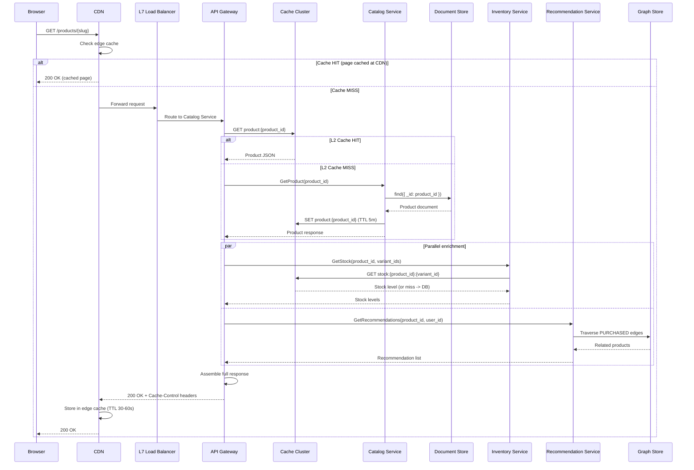
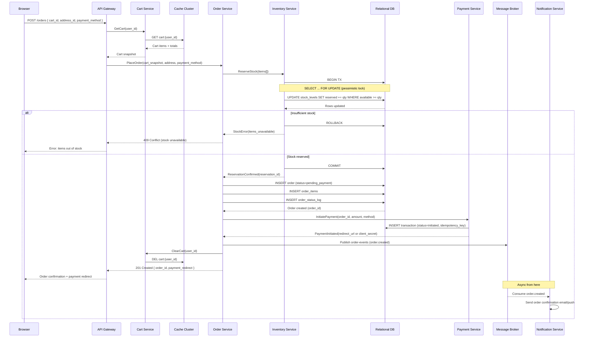
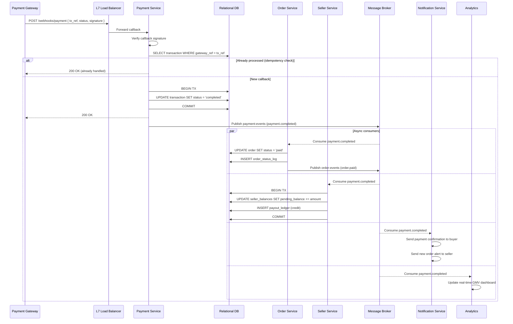
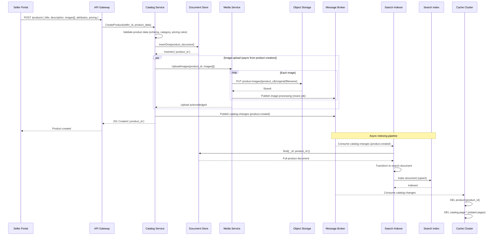
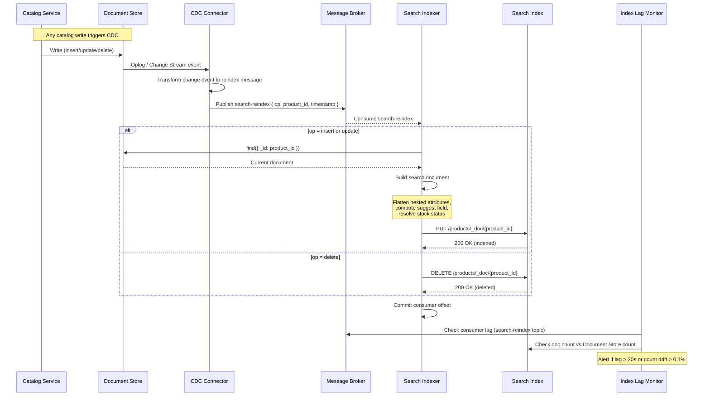
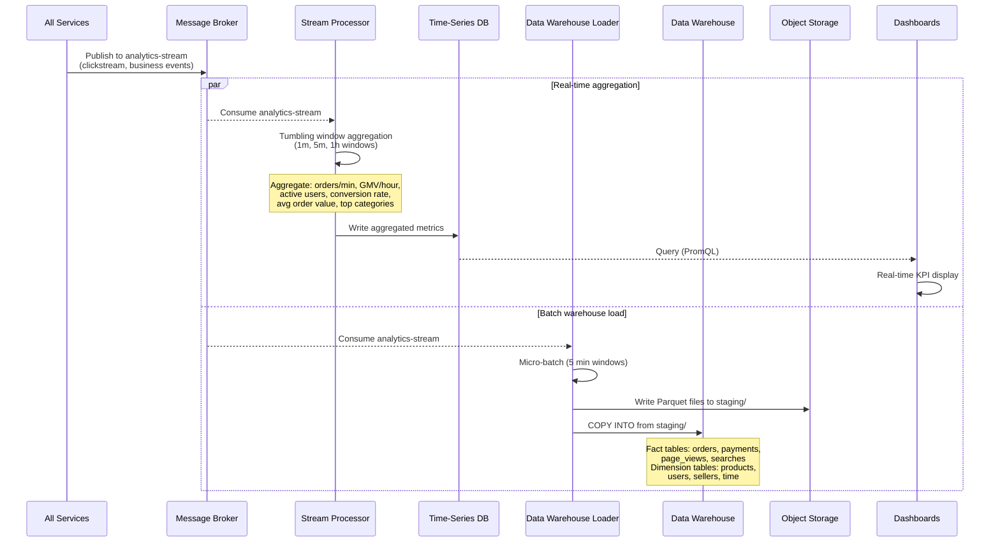
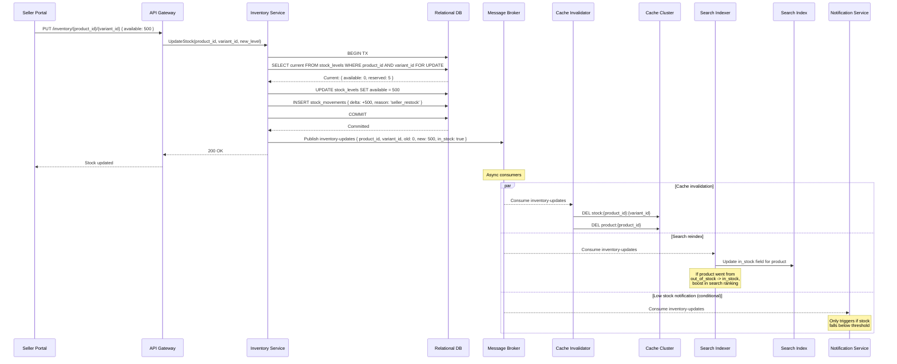

# Data Flows

This document describes the critical data flows through the marketplace platform. Each flow includes a sequence diagram, a summary of stores touched, sync/async boundaries, and failure handling.

---

## 1. Product Browsing Flow

A buyer opens a product listing page (e.g., from search results or a direct link).

### Sequence Diagram

### Stores Touched

| Store | Operation | Consistency |
|-------|-----------|-------------|
| CDN edge cache | Read | Eventual (TTL-based) |
| Cache Cluster (L2) | Read/Write | Eventual (TTL 5 min) |
| Document Store | Read | Strong (primary read) |
| Cache Cluster (stock) | Read | Eventual (TTL 60s) |
| Graph Store | Read | Eventual (batch-updated) |

### Sync vs Async

- Entire flow is **synchronous** from the buyer's perspective.
- Recommendation and inventory lookups are parallelized at the API Gateway to reduce latency.

### Failure Handling

- **CDN failure**: L7 LB routes directly to API Gateway (bypass CDN).
- **Cache miss**: graceful fallback to origin (Document Store).
- **Recommendation service down**: return empty recommendations; product page still renders.
- **Inventory service down**: show "check availability" instead of stock count; do not block page load.

---

## 2. Order Placement Flow

A buyer submits an order from their cart.

### Sequence Diagram

### Stores Touched

| Store | Operation | Consistency |
|-------|-----------|-------------|
| Cache Cluster (cart) | Read, Delete | Strong (primary data for cart) |
| Relational DB (inventory) | Read + Write (pessimistic lock) | Strong (serializable for stock) |
| Relational DB (orders) | Write | Strong (ACID) |
| Relational DB (payments) | Write | Strong (ACID) |
| Message Broker | Write (publish) | Durable (ack after replication) |

### Sync vs Async Boundary

- **Synchronous**: everything up to returning 201 to the browser (cart read, stock reservation, order write, payment initiation, cart clear).
- **Asynchronous**: notification dispatch, analytics event processing, search reindex (if stock changed).

### Failure Handling

- **Stock reservation fails**: transaction rolls back, buyer sees specific items that are unavailable.
- **Order DB write fails**: stock reservation is released via compensating transaction.
- **Payment initiation fails**: order marked as `payment_failed`, stock released after configurable timeout (15 min).
- **Broker publish fails**: order is still committed; a recovery worker scans for orders missing events and re-publishes (outbox pattern).
- **Idempotency**: `POST /orders` includes an idempotency key in the request header. Duplicate submissions return the existing order.

---

## 3. Payment Processing Flow

Payment gateway sends a callback after the buyer completes payment.

### Sequence Diagram

### Stores Touched

| Store | Operation | Consistency |
|-------|-----------|-------------|
| Relational DB (transactions) | Read + Write | Strong (ACID, idempotent) |
| Relational DB (orders) | Write (status update) | Strong (ACID) |
| Relational DB (seller_balances) | Write (balance credit) | Strong (serializable) |
| Relational DB (payout_ledger) | Write (append) | Strong (ACID) |
| Message Broker | Write (publish) + Read (consume) | Durable |
| Time-Series DB | Write (metrics) | Eventual |

### Sync vs Async Boundary

- **Synchronous**: callback receipt -> idempotency check -> transaction status update -> ack to gateway.
- **Asynchronous**: all downstream effects (order status, seller balance, notifications, analytics).

### Failure Handling

- **Duplicate callback**: idempotency check on `gateway_ref` returns 200 without reprocessing.
- **Transaction update fails**: return 500 to gateway; gateway will retry (callbacks are idempotent).
- **Consumer failures**: message stays on broker; consumer retries with exponential backoff. After N failures, routed to dead-letter topic.
- **Seller balance update fails**: isolated from payment acknowledgment. Retry from broker. Ledger reconciliation job runs hourly to detect and fix discrepancies.

---

## 4. Product Listing by Seller

A seller creates or updates a product in their catalog.

### Sequence Diagram

### Stores Touched

| Store | Operation | Consistency |
|-------|-----------|-------------|
| Document Store | Write (insert) | Strong (w:majority) |
| Object Storage | Write (PUT) | Durable after ack |
| Message Broker | Write (publish) | Durable |
| Search Index | Write (upsert) | Eventual (1-3s lag) |
| Cache Cluster | Delete (invalidation) | Eventual |

### Sync vs Async Boundary

- **Synchronous**: validation, document store write, return product_id to seller.
- **Asynchronous**: image processing (resize/optimize), search indexing, cache invalidation.

### Failure Handling

- **Validation failure**: 400 error returned to seller with specific field errors.
- **Document store write fails**: 500 error; seller retries. Idempotency key prevents duplicate products.
- **Image upload fails**: product is created without images; seller can retry image upload separately.
- **Search indexing fails**: product is in the catalog but not searchable until indexer retries. Alert fires if indexing lag exceeds 30 seconds.
- **Cache invalidation fails**: stale cache entry expires via TTL (5 min max staleness).

---

## 5. Search Indexing Pipeline

Near-real-time pipeline that keeps the search index in sync with the document store.

### Sequence Diagram

### Stores Touched

| Store | Operation | Consistency |
|-------|-----------|-------------|
| Document Store (oplog) | Read (CDC stream) | Real-time change stream |
| Message Broker | Write + Read | Durable, ordered per partition |
| Document Store | Read (full document fetch) | Strong (read from primary) |
| Search Index | Write (upsert/delete) | Eventual (refresh interval 1s) |

### Sync vs Async

- Entire pipeline is **asynchronous**. No part of this flow blocks the catalog write.

### Failure Handling

- **CDC connector fails**: connector restarts from last committed oplog position. No data loss.
- **Broker unavailable**: CDC buffers locally; retries. Catalog writes are unaffected.
- **Indexer fails on single document**: retry 3 times with backoff. After 3 failures, send to dead-letter topic. Other documents continue indexing.
- **Search cluster unavailable**: indexer pauses consumption. Messages accumulate in broker (retention: 1 day). Resume when cluster recovers.
- **Index drift detection**: hourly reconciliation job compares document counts and samples random documents for consistency.

---

## 6. Analytics Pipeline

Transforms raw event streams into aggregated metrics and warehouse tables.

### Sequence Diagram

### Stores Touched

| Store | Operation | Consistency |
|-------|-----------|-------------|
| Message Broker (analytics-stream) | Read (consume) | At-least-once |
| Time-Series DB | Write (aggregated metrics) | Eventual |
| Object Storage (staging) | Write (Parquet files) | Durable |
| Data Warehouse | Write (COPY INTO) | Eventual (5 min lag) |

### Sync vs Async

- Entire pipeline is **asynchronous**. No impact on user-facing latency.

### Failure Handling

- **Stream processor crash**: restarts from last checkpoint. Tumbling windows may produce slightly inaccurate counts for the affected window.
- **TSDB write fails**: stream processor retries with backoff. Dashboard shows gap in metrics.
- **DW loader fails**: micro-batch retried from broker offset. Parquet files are idempotent (overwrite on re-run).
- **Backpressure**: if consumers fall behind, broker retains messages (14-day retention on analytics-stream). Consumers catch up when capacity is available.

---

## 7. Inventory Sync Flow

Seller updates stock levels, triggering cache invalidation and search reindex.

### Sequence Diagram

### Stores Touched

| Store | Operation | Consistency |
|-------|-----------|-------------|
| Relational DB (stock_levels) | Read + Write (pessimistic lock) | Strong (serializable) |
| Relational DB (stock_movements) | Write (append) | Strong (ACID) |
| Message Broker | Write (publish) | Durable |
| Cache Cluster | Delete (invalidation) | Eventual |
| Search Index | Write (partial update) | Eventual (1-3s) |

### Sync vs Async Boundary

- **Synchronous**: stock level update in relational DB, ack to seller.
- **Asynchronous**: cache invalidation, search reindex, low-stock notifications.

### Failure Handling

- **DB write fails**: 500 error to seller; no side effects (transaction rolled back).
- **Broker publish fails**: stock is updated but event is lost. Outbox pattern (poll `stock_movements` table) recovers missed events.
- **Cache invalidation fails**: stale stock shown for up to 60s (TTL). Acceptable for display; actual stock check happens at order placement with pessimistic lock.
- **Search reindex fails**: product may show incorrect availability in search results. Self-heals when indexer retries or reconciliation job runs.

---

## 8. Data Flow Summary Matrix

| Flow | Sync Stores | Async Stores | Latency Budget | Consistency Model |
|------|-------------|-------------|----------------|-------------------|
| Product Browsing | Cache, Document Store, Graph Store | -- | < 150ms (cache hit), < 500ms (miss) | Eventual (cached) |
| Order Placement | Cache (cart), Relational DB (orders, inventory, payments) | Message Broker, Notification | < 1,000ms | Strong (ACID for writes) |
| Payment Processing | Relational DB (transactions) | Relational DB (orders, balances), Broker, Notification | < 500ms (webhook ack) | Strong + Eventual |
| Product Listing | Document Store | Object Storage, Search Index, Cache | < 2,000ms (with images) | Strong (write) + Eventual (index) |
| Search Indexing | -- | Document Store, Broker, Search Index | 1-3s end-to-end | Eventual |
| Analytics Pipeline | -- | Broker, Time-Series DB, Object Storage, Data Warehouse | Minutes (batch), Seconds (stream) | Eventual |
| Inventory Sync | Relational DB | Cache, Search Index, Broker | < 500ms (ack) | Strong (write) + Eventual (cache/search) |
