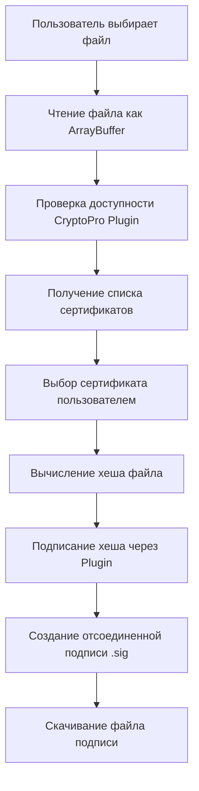

# План реализации подписания документов с CryptoPro Browser Plugin

## Обзор

Реализация формы для подписания документов усиленной квалифицированной электронной подписью с использованием официального пакета `crypto-pro-cadesplugin` от КриптоПро. Подписание выполняется полностью на клиенте без серверной части.

## Архитектура решения

## Основные компоненты

### 1. Установка зависимостей

- Установка официального пакета `crypto-pro-cadesplugin`
- Добавление TypeScript типов (если доступны)

### 2. Создание компонента формы подписания

Файл: [`src/App.tsx`](src/App.tsx)

Компонент будет включать:

- Поле выбора файла (`<input type="file">`)
- Кнопку "Подписать"
- Индикатор состояния (загрузка, успех, ошибка)
- Отображение информации о выбранном сертификате
- Обработку ошибок и валидацию

### 3. Реализация логики подписания

- Проверка доступности CryptoPro Plugin
- Получение списка доступных сертификатов
- Выбор сертификата (если несколько, показать диалог выбора)
- Чтение файла и преобразование в нужный формат
- Вычисление хеша файла через CryptoPro API
- Создание отсоединенной подписи (detached signature)
- Генерация и скачивание файла `[имя_файла].sig`

### 4. Обработка ошибок

- Проверка установки плагина
- Обработка ошибок чтения файла
- Обработка ошибок подписания
- Информативные сообщения для пользователя

## Технические детали

### Используемые методы CryptoPro API:

- Проверка доступности плагина
- `getCertsList()` - получение списка сертификатов
- `signHash()` или `signBase64()` - подписание (в зависимости от API пакета)
- Параметры для создания отсоединенной подписи (CMS, detached)

### Формат подписи:

- Отсоединенная подпись в формате CMS
- Расширение файла: `.sig`
- Имя файла: `[оригинальное_имя_файла].sig`

## Структура файлов

- `src/App.tsx` - основной компонент с формой подписания
- `src/types/cryptopro.d.ts` - TypeScript типы для CryptoPro API (если нужны)
- `src/utils/fileUtils.ts` - утилиты для работы с файлами (опционально)

## Требования перед использованием

Пользователю необходимо:

1. Установить КриптоПро ЭЦП Browser plug-in
2. Установить сертификат с закрытым ключом
3. Использовать поддерживаемый браузер (Chromium-Gost, Яндекс.Браузер для организаций)

## UI/UX

- Простой и понятный интерфейс
- Визуальная обратная связь о процессе подписания
- Понятные сообщения об ошибках
- Индикация выбранного файла и сертификата